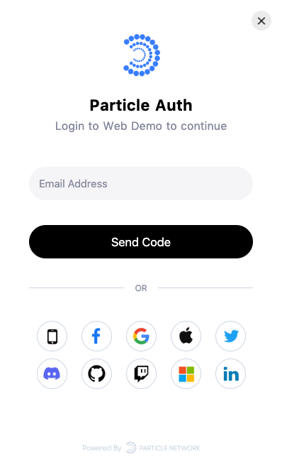

<a href="https://docs.particle.network">
  
</a>

# Particle Web Demo

This repository is [Particle Demo](https://web-demo.particle.network) source code. It supports Solana and EVM-compatiable chains, more chains and more features coming soon! Learn more visit [Particle Network](https://particle.network/).

🔥 Currently hosted [here](https://web-demo.particle.network).    


## Quick start

Add below config to `./packages/web-demo/.env` file, Replace 'xxx' with the new values created in the [Particle Dashboard](https://dashboard.particle.network/).

```
REACT_APP_PROJECT_ID=xxx
REACT_APP_CLIENT_KEY= xxx
REACT_APP_APP_ID=xxx

# if use waleltconnect, set walletconnect project id, created in https://walletconnect.com/
REACT_APP_WALLETCONNECT_PROJECT_ID=xxx
```

-   Install [Node.js](https://nodejs.org/).
-   Install [Yarn](https://classic.yarnpkg.com/en/docs/install#mac-stable)
-   Install [dotenv-cli](https://www.npmjs.com/package/dotenv-cli)
-   Run `yarn`
-   Run `yarn start:web-demo`

## Documentation

1. [Particle ConnectKit Service](https://docs.particle.network/connect-service/sdks/web)
2. [Particle Auth Service](https://docs.particle.network/auth-service/sdks/web)
3. [Particle Wallet Service](https://docs.particle.network/wallet-service/sdks/web)
4. [Particle Node Service](https://docs.particle.network/node-service/introduction)


⚡️ For full documentation, visit [Docs](https://docs.particle.network). 

## Features

</img>

Particle Auth is a simple self-custodial auth infra for Web3 apps and wallets. We support mobile number and email login, providing users with a simple operating experience. Their login account is then associated with a blockchain wallet, which is secured with a "Threshold Signatures vault".    

* Speedy logins: the log-in process is no different from that of a Web2.0 login, which greatly lowers the barriers to entry and improves user experience.
* Non-custodial private key infrastructure: Particle Network provides MPC (Multi-Party Computation)-based TSS (Threshold Signatures Scheme). With TSS, each party creates an independent key. They then forge the vault's lock together in a modular way, in which each party shapes a part of the lock that corresponds to its key. The user is always in control of ownership and access to their cryptographic key pair.
* Custom UI: customize Particle Auth's UI so that it blends directly into your application, you can brand in the Dashboard.
* Signature Service: a full signature service, including Send Transaction, Sign Message and so on. Your users can view the detailed data of each signature.

## Examples

### 🔥ConnectKit

</img>

Modular wallet adapters and components for EVM & Solana chains. Manage wallet and custom RPC requests. Particle Connect is the best way to onboard any user for your dApp. Join our [Discord](https://discord.com/invite/2y44qr6CR2) community to give us feedback.

* [with create-react-app](/packages/react-connect-starter)
* [with next.js](/packages/next-connect-starter)
* [with vue](/packages/vue-vite-starter)
* [react custom connectKit](/packages/custom-connect-starter)

You can run these demos locally.    

👉 [Live Demo](https://web-demo.particle.network/connectKit)

### RainbowKit

If you use [RainbowKit](https://www.rainbowkit.com/) connect wallet, you can add particle auth quickly. Refer to the following demo.

🌈 [particle + rainbowkit + next](/packages/rainbowkit-next-starter)

👉  [Live Demo](https://web-demo.particle.network/rainbowKit)

Visit [Docs](https://docs.particle.network/auth-service/sdks/web#evm-rainbowkit-integration) for more details.


### Web3Modal

</img>
    
    
Add particle to [web3modal](https://github.com/WalletConnect/web3modal). Refer to the following demo.

 ✅ [react + web3modal](/packages/web-demo/src/pages/web3Modal)
 
 👉 [Live Demo](https://web-demo.particle.network/web3Modal)


### Web3React

Use Particle with [web3-react](https://github.com/Uniswap/web3-react). Refer to the following demo.

[with web3-react](/packages/web3-react-starter)


## Give Feedback

Please report bugs or issues to [particle-web-demo/issues](https://github.com/Particle-Network/particle-web-demo/issues)

You can also join our [Discord](https://discord.gg/2y44qr6CR2).
